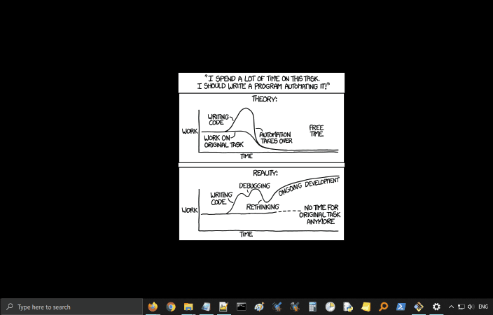

# chgWinWallpaper
Python script to change the Windows desktop background so that it displays a different xkcd comic every day.

My previous repository consisted of downloading all of the xkcd comics from https://xkcd.com. This was my own take on a project from Al Sweigart's book "Automate the Boring Stuff" http://automatetheboringstuff.com/2e/chapter12/. Since I had used my script to save all of the comics to my hard drive, I thought I would write another script to display a different xkcd comic every day, starting with the very first one.

The script queries the Windows registry to get the current desktop background image, and, using the number in the filename as a reference, changes it to the next one in the xkcd images folder (in ascending numerical order).

## :computer: Usage

Change the path in the script so that it points to whichever directory you have the images saved, then use Task Scheduler to schedule the script to run at the frequency you want.

I schedule it so that the comics change daily, but you could set it to hourly, weekly, whatever you want.

You could also use this with any other folder that contains images. As long as the image filenames start with a number, the script will change images by ascending order.

## :snake: Dependencies

Written in Python for Windows. This script uses the following Python modules: ctypes, os, sys, winreg (and all submodules).
